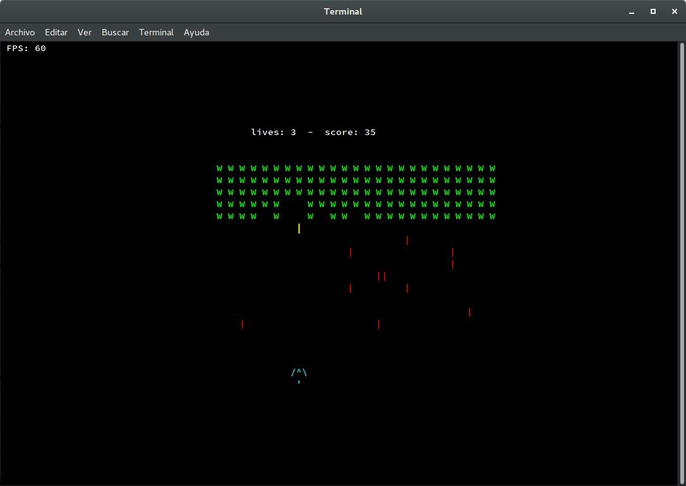
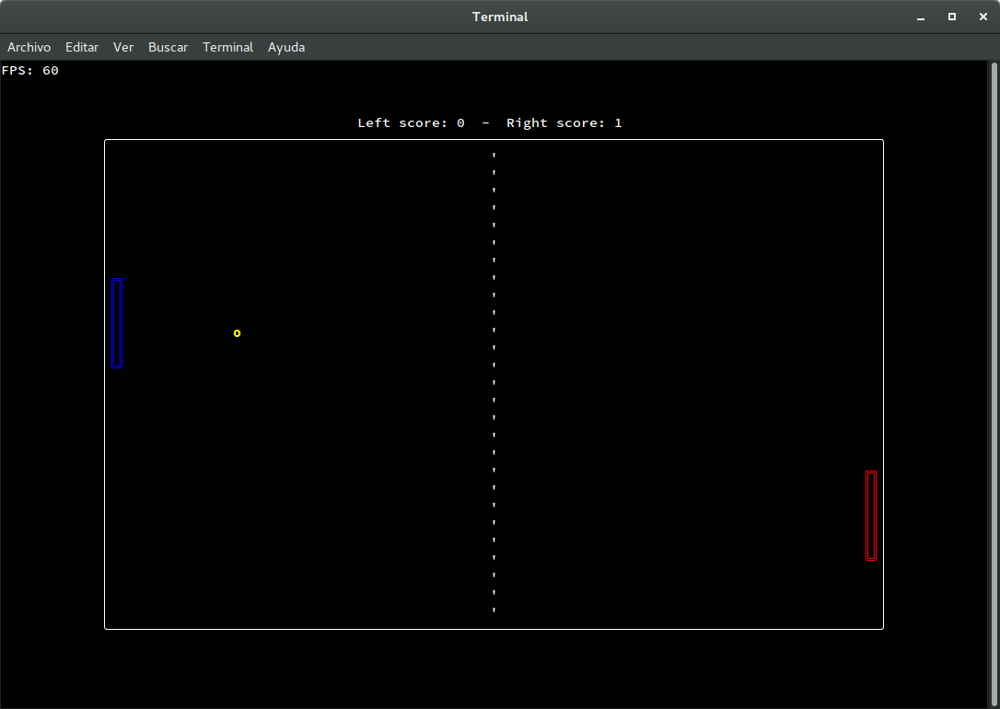

[](https://crates.io/crates/ruscii)
[](https://www.apache.org/licenses/LICENSE-2.0.txt)
[](https://crates.io/crates/ruscii)

# `ruscii`
An easy library to make terminal applications and games in *rust*.

The aim of this project is to make easier the game development in terminals.
Any contribution, issue, or pull request would be welcome!

### Features
- Optimized to render fast in terminals.
- Multi-platform (Linux, Windows and MacOS)
- Multi-terminal (See [crossterm terminal support](https://github.com/crossterm-rs/crossterm#tested-terminals))
- Enable **key press** and **release** events in terminal (essential for games!)
- Easy to use. Make your terminal game in a few lines!
- Easy way to recover the terminal state at error.

## Examples
You can found several examples into the [example folder](examples).

To test an example, install `ruscii` with the examples flag and run it.
```
cargo install ruscii --examples
~/.cargo/bin/<example_name>
```

Or clone the repo and execute inside of it:
```
cargo run --example <example_name> --release
```

### Some of these examples:
#### Space invaders ([200 lines](examples/space_invaders.rs)):
  

#### Pong ([150 lines](examples/pong.rs)):
  

